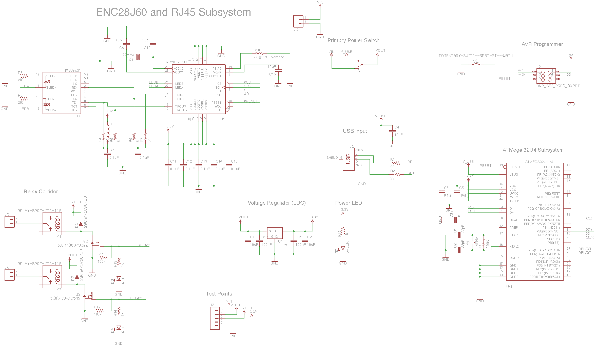
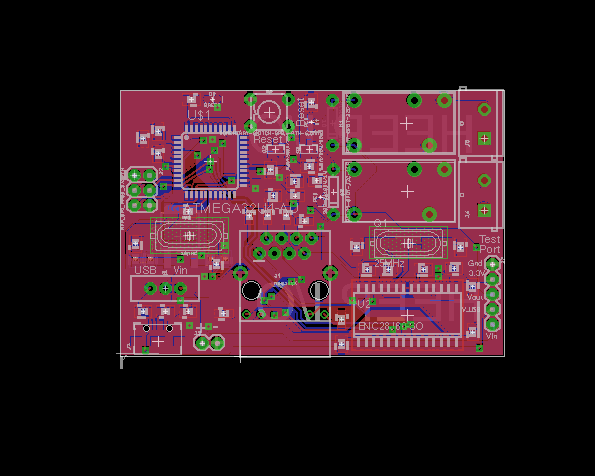

# ATMega32u4 Board

### Description

This circuit board is designed to communicate with a Heep system without the need for any Arduino or Teensy circuit boards. It contains 2 relays, an ATMega32u4 Processor, and an ENC28J60 Ethernet Controller

### Schematic

### Layout

